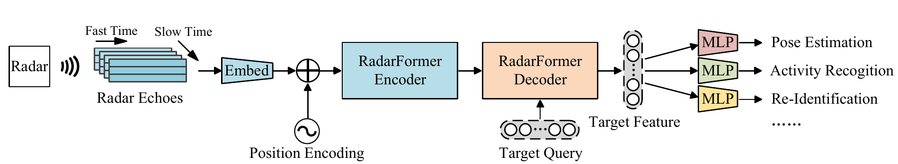
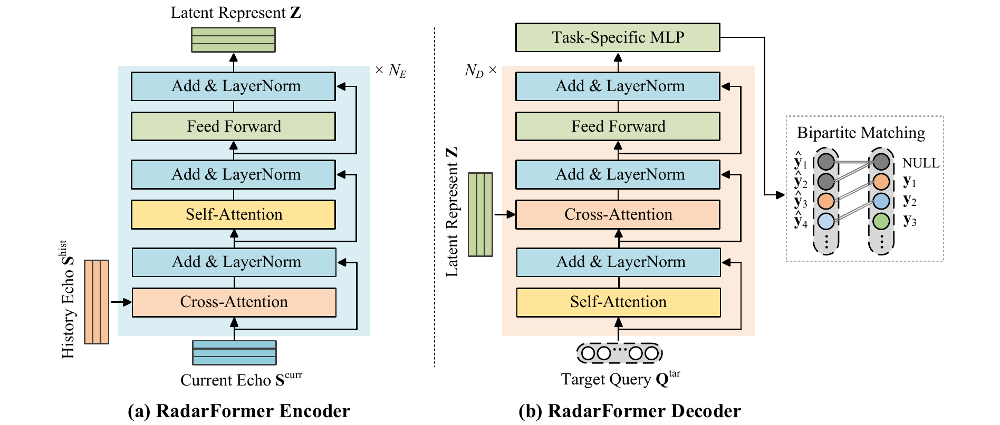
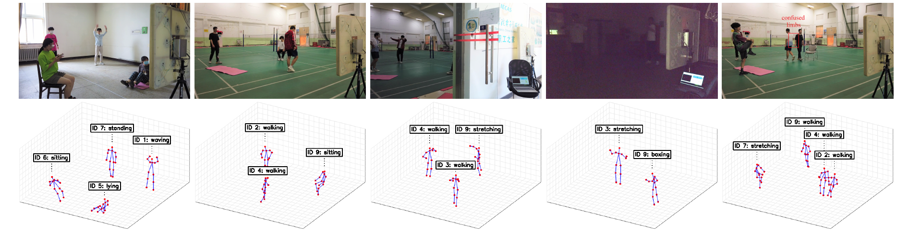

# RadarFormer: Radar-based End-to-End Human Perception with Transformers
- [paper link]()

### 1. Introduction

- **Abstract**：For fine-grained human perception tasks such as pose estimation and activity recognition, radar sensors show advantages over optical sensors in low-visibility, privacy-aware, and wall-occlusive environments.
Most radar-based human perception methods extract information with convolutional neural networks from radar images.
This paper proposes RadarFormer, which introduces the self-attention mechanism to perform human perception directly from radar echoes.
It bypasses the radar imaging algorithm and realizes end-to-end signal processing.
Specifically, we give constructive proof that processing radar echoes using the self-attention mechanism is at least as expressive as processing radar images using the convolutional layer.
On this foundation, we design RadarFormer, which is a Transformer-like model to extract human representations from radar echoes and handle various downstream perception tasks.
We evaluate the proposed method on human pose estimation, activity recognition, and re-identification tasks.
Experimental results demonstrate that our method outperforms state-of-the-art radar-based methods both in performance and computational cost, and obtains accurate human perception results even in dark and occlusive environments.






### 2. Installation

```
git clone https://github.com/0809zheng/RadarFormer.git
cd RadarFormer
pip install -r requirements.txt
```

### 3. Training

```
python train.py
```

### 4. Testing

```
python test.py
``` 

### 5. Citations

If you find this work useful, please consider citing it.

